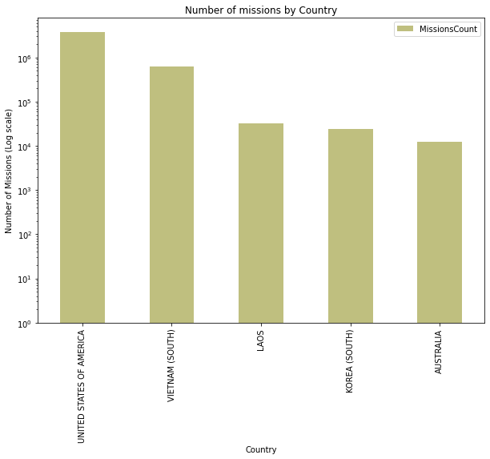
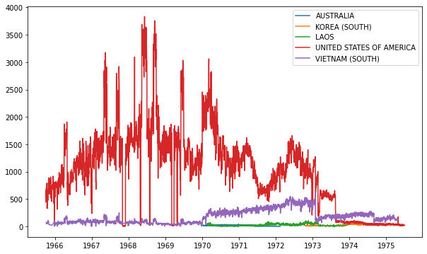

# Spark | Applied Data Analysis | Vietnam War

Thanks for visiting my GitHub page. This project is about applying data analysis skills using Spark on Vientam War. Please follow interactive instructions to learn more about this project in this README.md file.

### Setup

Let's setup Spark on Colab environment.  Run the cell below!


```python
!pip install pyspark
!pip install -U -q PyDrive
!apt install openjdk-8-jdk-headless -qq
import os
os.environ["JAVA_HOME"] = "/usr/lib/jvm/java-8-openjdk-amd64"
```

    Collecting pyspark
      Downloading pyspark-3.1.2.tar.gz (212.4 MB)
         |████████████████████████████████| 212.4 MB 21 kB/s 
    [?25hCollecting py4j==0.10.9
      Downloading py4j-0.10.9-py2.py3-none-any.whl (198 kB)
         |████████████████████████████████| 198 kB 56.9 MB/s 


Lets authenticate a Google Drive client to download the file we will be processing on Spark job.


```python
from pydrive.auth import GoogleAuth
from pydrive.drive import GoogleDrive
from google.colab import auth
from oauth2client.client import GoogleCredentials

# Authenticate and create the PyDrive client
auth.authenticate_user()
gauth = GoogleAuth()
gauth.credentials = GoogleCredentials.get_application_default()
drive = GoogleDrive(gauth)
```


```python
id='1L6pCQkldvdBoaEhRFzL0VnrggEFvqON4'
downloaded = drive.CreateFile({'id': id}) 
downloaded.GetContentFile('Bombing_Operations.json.gz')

id='14dyBmcTBA32uXPxDbqr0bFDIzGxMTWwl'
downloaded = drive.CreateFile({'id': id}) 
downloaded.GetContentFile('Aircraft_Glossary.json.gz')  
```

If you executed the cells above, you should be able to see the files *Bombing_Operations.json.gz* and *Aircraft_Glossary.json.gz* under the "Files" tab on the left panel.


```python
# Let's import the libraries we will need
import pandas as pd
import numpy as np
import matplotlib.pyplot as plt
%matplotlib inline

import pyspark
from pyspark.sql import *
from pyspark.sql.functions import *
from pyspark import SparkContext, SparkConf
```

Let's initialize the Spark context.


```python
# create the session
conf = SparkConf().set("spark.ui.port", "4050")

# create the context
sc = pyspark.SparkContext(conf=conf)
spark = SparkSession.builder.getOrCreate()
```

We can easily check the current version and get the link of the web interface. In the Spark UI, It is easy to monitor the progress of job and debug the performance bottlenecks (if your Colab is running with a **local runtime**).


```python
spark
```
```python
SparkSession - in-memory
SparkContext
Spark UI
Version
v3.1.2
Master
local[*]
AppName
pyspark-shell
```


The cell below will create a *ngrok* tunnel which will allow us to still check the Spark UI.


```python
!wget https://bin.equinox.io/c/4VmDzA7iaHb/ngrok-stable-linux-amd64.zip
!unzip ngrok-stable-linux-amd64.zip
get_ipython().system_raw('./ngrok http 4050 &')
!curl -s http://localhost:4040/api/tunnels | python3 -c \
    "import sys, json; print(json.load(sys.stdin)['tunnels'][0]['public_url'])"
```

    --2021-10-06 03:56:26--  https://bin.equinox.io/c/4VmDzA7iaHb/ngrok-stable-linux-amd64.zip
    Resolving bin.equinox.io (bin.equinox.io)... 54.161.241.46, 18.205.222.128, 52.202.168.65, ...
    Connecting to bin.equinox.io (bin.equinox.io)|54.161.241.46|:443... connected.
    HTTP request sent, awaiting response... 200 OK
    Length: 13832437 (13M) [application/octet-stream]
    Saving to: ‘ngrok-stable-linux-amd64.zip’
    
    ngrok-stable-linux- 100%[===================>]  13.19M  5.40MB/s    in 2.4s    
    
    2021-10-06 03:56:29 (5.40 MB/s) - ‘ngrok-stable-linux-amd64.zip’ saved [13832437/13832437]
    
    Archive:  ngrok-stable-linux-amd64.zip
      inflating: ngrok                   
    Traceback (most recent call last):
      File "<string>", line 1, in <module>
    IndexError: list index out of range


# Vietnam War

**Pres. Johnson**: _What do you think about this Vietnam thing? I’d like to hear you talk a little bit._

**Sen. Russell**: _Well, frankly, Mr. President, it’s the damn worse mess that I ever saw, and I don’t like to brag and I never have been right many times in my life, but I knew that we were going to get into this sort of mess when we went in there._

May 27, 1964


----

The Vietnam War, also known as the Second Indochina War, and in Vietnam as the Resistance War Against America or simply the American War, was a conflict that occurred in Vietnam, Laos, and Cambodia from 1 November 1955 to the fall of Saigon on 30 April 1975. It was the second of the Indochina Wars and was officially fought between North Vietnam and the government of South Vietnam.

**The dataset describes all the air force operation in during the Vietnam War.**

**Bombing_Operations** [Get the dataset here](https://drive.google.com/a/epfl.ch/file/d/1L6pCQkldvdBoaEhRFzL0VnrggEFvqON4/view?usp=sharing)

- AirCraft: _Aircraft model (example: EC-47)_
- ContryFlyingMission: _Country_
- MissionDate: _Date of the mission_
- OperationSupported: _Supported War operation_ (example: [Operation Rolling Thunder](https://en.wikipedia.org/wiki/Operation_Rolling_Thunder))
- PeriodOfDay: _Day or night_
- TakeoffLocation: _Take off airport_
- TimeOnTarget
- WeaponType
- WeaponsLoadedWeight

**Aircraft_Glossary** [Get the dataset here](https://drive.google.com/a/epfl.ch/file/d/14dyBmcTBA32uXPxDbqr0bFDIzGxMTWwl/view?usp=sharing)

- AirCraft: _Aircraft model (example: EC-47)_
- AirCraftName
- AirCraftType

**Dataset Information:**

THOR is a painstakingly cultivated database of historic aerial bombings from World War I through Vietnam. THOR has already proven useful in finding unexploded ordnance in Southeast Asia and improving Air Force combat tactics:
https://www.kaggle.com/usaf/vietnam-war-bombing-operations

Load the datasets:


```python
Bombing_Operations = spark.read.json("Bombing_Operations.json.gz")
Aircraft_Glossary = spark.read.json("Aircraft_Glossary.json.gz")
```

Check the schema:


```python
Bombing_Operations.printSchema()
```

    root
     |-- AirCraft: string (nullable = true)
     |-- ContryFlyingMission: string (nullable = true)
     |-- MissionDate: string (nullable = true)
     |-- OperationSupported: string (nullable = true)
     |-- PeriodOfDay: string (nullable = true)
     |-- TakeoffLocation: string (nullable = true)
     |-- TargetCountry: string (nullable = true)
     |-- TimeOnTarget: double (nullable = true)
     |-- WeaponType: string (nullable = true)
     |-- WeaponsLoadedWeight: long (nullable = true)
    


```python
Aircraft_Glossary.printSchema()
```

    root
     |-- AirCraft: string (nullable = true)
     |-- AirCraftName: string (nullable = true)
     |-- AirCraftType: string (nullable = true)
    


Get a sample with `take()`:


```python
Bombing_Operations.take(3)
```


    [Row(AirCraft='EC-47', ContryFlyingMission='UNITED STATES OF AMERICA', MissionDate='1971-06-05', OperationSupported=None, PeriodOfDay='D', TakeoffLocation='TAN SON NHUT', TargetCountry='CAMBODIA', TimeOnTarget=1005.0, WeaponType=None, WeaponsLoadedWeight=0),
     Row(AirCraft='EC-47', ContryFlyingMission='UNITED STATES OF AMERICA', MissionDate='1972-12-26', OperationSupported=None, PeriodOfDay='D', TakeoffLocation='NAKHON PHANOM', TargetCountry='SOUTH VIETNAM', TimeOnTarget=530.0, WeaponType=None, WeaponsLoadedWeight=0),
     Row(AirCraft='RF-4', ContryFlyingMission='UNITED STATES OF AMERICA', MissionDate='1973-07-28', OperationSupported=None, PeriodOfDay='D', TakeoffLocation='UDORN AB', TargetCountry='LAOS', TimeOnTarget=730.0, WeaponType=None, WeaponsLoadedWeight=0)]


Get a formatted sample with `show()`:


```python
Aircraft_Glossary.show()
```

    +--------+--------------------+--------------------+
    |AirCraft|        AirCraftName|        AirCraftType|
    +--------+--------------------+--------------------+
    |     A-1|Douglas A-1 Skyra...|         Fighter Jet|
    |    A-26|Douglas A-26 Invader|        Light Bomber|
    |    A-37|Cessna A-37 Drago...|Light ground-atta...|
    |     A-4|McDonnell Douglas...|         Fighter Jet|
    |     A-5|North American A-...|          Bomber Jet|
    |     A-6|Grumman A-6 Intruder|     Attack Aircraft|
    |     A-7|  LTV A-7 Corsair II|     Attack Aircraft|
    |  AC-119|Fairchild AC-119 ...|Military Transpor...|
    |  AC-123|Fairchild C-123 P...|Military Transpor...|
    |  AC-130|Lockheed AC-130 S...|Fixed wing ground...|
    |   AC-47|Douglas AC-47 Spooky|Ground attack air...|
    |    AH-1| Bell AH-1 HueyCobra|          Helicopter|
    |     B-1| Rockwell B-1 Lancer|Heavy strategic b...|
    |    B-52| B-52 Stratofortress|    Strategic bomber|
    |    B-57|Martin B-57 Canberra|     Tactical Bomber|
    |    B-66|Douglas B-66 Dest...|        Light Bomber|
    |     C-1| Grumman C-1A Trader|           Transport|
    |   C-117|     C-117D Skytrain|           Transport|
    |   C-119|Fairchild C-119 F...|Military Transpor...|
    |   C-123|Fairchild C-123 P...|Military Transpor...|
    +--------+--------------------+--------------------+
    only showing top 20 rows
    


```python
print("In total there are {0} operations".format(Bombing_Operations.count()))
```

    In total there are 4400775 operations


## Which countries are involved and in how many missions? 

Keywords: `Dataframe API`, `SQL`, `group by`, `sort`

Let's group the missions by `ContryFlyingMission` and count how many records exist:


```python
missions_counts = Bombing_Operations.groupBy("ContryFlyingMission")\
                                    .agg(count("*").alias("MissionsCount"))\
                                    .sort(desc("MissionsCount"))
missions_counts.show()
```

    +--------------------+-------------+
    | ContryFlyingMission|MissionsCount|
    +--------------------+-------------+
    |UNITED STATES OF ...|      3708997|
    |     VIETNAM (SOUTH)|       622013|
    |                LAOS|        32777|
    |       KOREA (SOUTH)|        24469|
    |           AUSTRALIA|        12519|
    +--------------------+-------------+
    


In this case I have used the DataFrame API, but I could rewite the `groupBy` using pure SQL:


```python
Bombing_Operations.registerTempTable("Bombing_Operations")

query = """
SELECT ContryFlyingMission, count(*) as MissionsCount
FROM Bombing_Operations
GROUP BY ContryFlyingMission
ORDER BY MissionsCount DESC
"""

missions_counts = spark.sql(query)
missions_counts.show()
```

    +--------------------+-------------+
    | ContryFlyingMission|MissionsCount|
    +--------------------+-------------+
    |UNITED STATES OF ...|      3708997|
    |     VIETNAM (SOUTH)|       622013|
    |                LAOS|        32777|
    |       KOREA (SOUTH)|        24469|
    |           AUSTRALIA|        12519|
    +--------------------+-------------+
    


The Dataframe is small enough to be moved to Pandas:


```python
missions_count_pd = missions_counts.toPandas()
missions_count_pd.head()
```


<table border="1" class="dataframe">
  <thead>
    <tr style="text-align: right;">
      <th></th>
      <th>ContryFlyingMission</th>
      <th>MissionsCount</th>
    </tr>
  </thead>
  <tbody>
    <tr>
      <th>0</th>
      <td>UNITED STATES OF AMERICA</td>
      <td>3708997</td>
    </tr>
    <tr>
      <th>1</th>
      <td>VIETNAM (SOUTH)</td>
      <td>622013</td>
    </tr>
    <tr>
      <th>2</th>
      <td>LAOS</td>
      <td>32777</td>
    </tr>
    <tr>
      <th>3</th>
      <td>KOREA (SOUTH)</td>
      <td>24469</td>
    </tr>
    <tr>
      <th>4</th>
      <td>AUSTRALIA</td>
      <td>12519</td>
    </tr>
  </tbody>
</table>
</div>


Let's plot a barchart with the number of missions by country:


```python
pl = missions_count_pd.plot(kind="bar", 
                            x="ContryFlyingMission", y="MissionsCount", 
                            figsize=(10, 7), log=True, alpha=0.5, color="olive")
pl.set_xlabel("Country")
pl.set_ylabel("Number of Missions (Log scale)")
pl.set_title("Number of missions by Country")
```


    Text(0.5, 1.0, 'Number of missions by Country')


    

    


----

## Let's see the number of missions in time for each of the countries involved.

Keywords: `group by`, `parse date`, `plot`

Selecting the relevant columns:


```python
missions_countries = Bombing_Operations.selectExpr(["to_date(MissionDate) as MissionDate", "ContryFlyingMission"])
missions_countries
```


    DataFrame[MissionDate: date, ContryFlyingMission: string]


The filed MissionDate is converted to a Python `date` object.

Now I can group by `MissionDate` and `ContryFlyingMission` to get the count:


```python
missions_by_date = missions_countries\
                    .groupBy(["MissionDate", "ContryFlyingMission"])\
                    .agg(count("*").alias("MissionsCount"))\
                    .sort(asc("MissionDate")).toPandas()
missions_by_date.head()
```


<div>
<style scoped>
    .dataframe tbody tr th:only-of-type {
        vertical-align: middle;
    }

    .dataframe tbody tr th {
        vertical-align: top;
    }

    .dataframe thead th {
        text-align: right;
    }
</style>
<table border="1" class="dataframe">
  <thead>
    <tr style="text-align: right;">
      <th></th>
      <th>MissionDate</th>
      <th>ContryFlyingMission</th>
      <th>MissionsCount</th>
    </tr>
  </thead>
  <tbody>
    <tr>
      <th>0</th>
      <td>1965-10-01</td>
      <td>UNITED STATES OF AMERICA</td>
      <td>447</td>
    </tr>
    <tr>
      <th>1</th>
      <td>1965-10-02</td>
      <td>UNITED STATES OF AMERICA</td>
      <td>652</td>
    </tr>
    <tr>
      <th>2</th>
      <td>1965-10-03</td>
      <td>UNITED STATES OF AMERICA</td>
      <td>608</td>
    </tr>
    <tr>
      <th>3</th>
      <td>1965-10-04</td>
      <td>UNITED STATES OF AMERICA</td>
      <td>532</td>
    </tr>
    <tr>
      <th>4</th>
      <td>1965-10-05</td>
      <td>UNITED STATES OF AMERICA</td>
      <td>697</td>
    </tr>
  </tbody>
</table>
</div>


Now I can plot the content with a different series for each country:


```python
fig = plt.figure(figsize=(10, 6))

# iterate the different groups to create a different series
for country, missions in missions_by_date.groupby("ContryFlyingMission"): 
    plt.plot(missions["MissionDate"], missions["MissionsCount"], label=country)

plt.legend(loc='best')
```


    <matplotlib.legend.Legend at 0x7f945319c0d0>


    

    


Let's observe how South Vietnam increased its missions starting from 1970. The drop in 1973 is motivated by the [Paris Peace Accords](https://en.wikipedia.org/wiki/Paris_Peace_Accords) that took place on January 27th, 1973, to establish peace in Vietnam and end the war.

----

## Who bombed this location?

Keywords: `RDD map reduce` `cache` `save results`


This picture is the Hanoi POL facility (North Vietnam) burning after it was attacked by the U.S. Air Force on 29 June 1966 in the context of the Rolling Thunder operation. 

I am interested in discovering what was the most common take-off location during that day.


```python
jun_29_operations = Bombing_Operations.where("MissionDate = '1966-06-29' AND TargetCountry='NORTH VIETNAM'")
```

Which coutries scheduled missions that day?


```python
jun_29_operations.groupBy("ContryFlyingMission").agg(count("*").alias("MissionsCount")).toPandas()
```


<div>
<style scoped>
    .dataframe tbody tr th:only-of-type {
        vertical-align: middle;
    }

    .dataframe tbody tr th {
        vertical-align: top;
    }

    .dataframe thead th {
        text-align: right;
    }
</style>
<table border="1" class="dataframe">
  <thead>
    <tr style="text-align: right;">
      <th></th>
      <th>ContryFlyingMission</th>
      <th>MissionsCount</th>
    </tr>
  </thead>
  <tbody>
    <tr>
      <th>0</th>
      <td>VIETNAM (SOUTH)</td>
      <td>6</td>
    </tr>
    <tr>
      <th>1</th>
      <td>UNITED STATES OF AMERICA</td>
      <td>389</td>
    </tr>
  </tbody>
</table>
</div>


Most of the operation that day were performed by USA airplanes.


```python
jun_29_operations.take(1)
```


    [Row(AirCraft='F-105', ContryFlyingMission='UNITED STATES OF AMERICA', MissionDate='1966-06-29', OperationSupported='STEEL TIGER', PeriodOfDay='D', TakeoffLocation='TAKHLI', TargetCountry='NORTH VIETNAM', TimeOnTarget=310.0, WeaponType='1000LB MK-83', WeaponsLoadedWeight=-1)]


I am specifying to cache the content in memory:


```python
jun_29_operations.cache()
```


    DataFrame[AirCraft: string, ContryFlyingMission: string, MissionDate: string, OperationSupported: string, PeriodOfDay: string, TakeoffLocation: string, TargetCountry: string, TimeOnTarget: double, WeaponType: string, WeaponsLoadedWeight: bigint]


Now let's count the number of rows and move the content to the cache:


```python
%time jun_29_operations.count()
```

    CPU times: user 38.5 ms, sys: 7.27 ms, total: 45.8 ms
    Wall time: 8 s


    395


It appears that he second time content is cached and the operation is much faster:


```python
%time jun_29_operations.count()
```

    CPU times: user 3.9 ms, sys: 13 µs, total: 3.92 ms
    Wall time: 79.7 ms


    395


Save the results on a file...


```python
jun_29_operations.write.mode('overwrite').json("jun_29_operations.json")
```

... and reading from the file:


```python
jun_29_operations = spark.read.json("jun_29_operations.json")
```

Using the simple DataFrame API...


```python
TakeoffLocationCounts = jun_29_operations\
                            .groupBy("TakeoffLocation").agg(count("*").alias("MissionsCount"))\
                            .sort(desc("MissionsCount"))
TakeoffLocationCounts.show()
```

    +----------------+-------------+
    | TakeoffLocation|MissionsCount|
    +----------------+-------------+
    |   CONSTELLATION|           87|
    |          TAKHLI|           56|
    |           KORAT|           55|
    |         UBON AB|           44|
    |        UDORN AB|           44|
    |          DANANG|           35|
    |          RANGER|           35|
    |    TAN SON NHUT|           26|
    |HANCOCK (CVA-19)|           10|
    |    CAM RANH BAY|            2|
    |         CUBI PT|            1|
    +----------------+-------------+
    


... or the explicit Map/Reduce format with RDDs.

First let's emit a pair in the format (Location, 1):


```python
all_locations = jun_29_operations.rdd.map(lambda row: (row.TakeoffLocation, 1))
all_locations.take(3)
```


    [('TAKHLI', 1), ('DANANG', 1), ('CONSTELLATION', 1)]


Then, summing counters in the reducing step, and sorting by count:


```python
locations_counts_rdd = all_locations.reduceByKey(lambda a, b: a+b).sortBy(lambda r: -r[1])
locations_counts_rdd.take(3)
```


    [('CONSTELLATION', 87), ('TAKHLI', 56), ('KORAT', 55)]


Let me convert the RDD in dataframe by mapping the pairs to objects of type `Row`


```python
locations_counts_with_schema = locations_counts_rdd.map(lambda r: Row(TakeoffLocation=r[0], MissionsCount=r[1]))
locations_counts = spark.createDataFrame(locations_counts_with_schema)
locations_counts.show()
```

    +----------------+-------------+
    | TakeoffLocation|MissionsCount|
    +----------------+-------------+
    |   CONSTELLATION|           87|
    |          TAKHLI|           56|
    |           KORAT|           55|
    |         UBON AB|           44|
    |        UDORN AB|           44|
    |          DANANG|           35|
    |          RANGER|           35|
    |    TAN SON NHUT|           26|
    |HANCOCK (CVA-19)|           10|
    |    CAM RANH BAY|            2|
    |         CUBI PT|            1|
    +----------------+-------------+
    


That day the most common take-off location was the ship USS Constellation (CV-64). We cannot univocally identify one take off location, but we can reduce the possible candidates. Next steps: explore TimeOnTarget feature.

_USS Constellation (CV-64), a Kitty Hawk-class supercarrier, was the third ship of the United States Navy to be named in honor of the "new constellation of stars" on the flag of the United States. One of the fastest ships in the Navy, as proven by her victory during a battlegroup race held in 1985, she was nicknamed "Connie" by her crew and officially as "America's Flagship"._

----

## What is the most used aircraft type during the Vietnam war (number of missions)?

Keywords: `join` `group by`

Let's check the content of `Aircraft_Glossary`:


```python
Aircraft_Glossary.show(5)
```

    +--------+--------------------+--------------------+
    |AirCraft|        AirCraftName|        AirCraftType|
    +--------+--------------------+--------------------+
    |     A-1|Douglas A-1 Skyra...|         Fighter Jet|
    |    A-26|Douglas A-26 Invader|        Light Bomber|
    |    A-37|Cessna A-37 Drago...|Light ground-atta...|
    |     A-4|McDonnell Douglas...|         Fighter Jet|
    |     A-5|North American A-...|          Bomber Jet|
    +--------+--------------------+--------------------+
    only showing top 5 rows
    


I am interested in the filed `AirCraftType`.


```python
Bombing_Operations.select("AirCraft").show(5)
```

    +--------+
    |AirCraft|
    +--------+
    |   EC-47|
    |   EC-47|
    |    RF-4|
    |     A-1|
    |    A-37|
    +--------+
    only showing top 5 rows
    


Joining on the column `AirCraft` of both dataframes.

With Dataframe API:


```python
missions_joined = Bombing_Operations.join(Aircraft_Glossary, 
                                          Bombing_Operations.AirCraft == Aircraft_Glossary.AirCraft)
missions_joined
```


    DataFrame[AirCraft: string, ContryFlyingMission: string, MissionDate: string, OperationSupported: string, PeriodOfDay: string, TakeoffLocation: string, TargetCountry: string, TimeOnTarget: double, WeaponType: string, WeaponsLoadedWeight: bigint, AirCraft: string, AirCraftName: string, AirCraftType: string]


Selecting only the field we are interested in:


```python
missions_aircrafts = missions_joined.select("AirCraftType")
missions_aircrafts.show(5)
```

    +--------------------+
    |        AirCraftType|
    +--------------------+
    |Military Transpor...|
    |Military Transpor...|
    |  Fighter bomber jet|
    |         Fighter Jet|
    |Light ground-atta...|
    +--------------------+
    only showing top 5 rows
    


And finally grouping by `AirCraftType` and count:


```python
missions_aircrafts.groupBy("AirCraftType").agg(count("*").alias("MissionsCount"))\
                  .sort(desc("MissionsCount"))\
                  .show()
```

    +--------------------+-------------+
    |        AirCraftType|MissionsCount|
    +--------------------+-------------+
    |  Fighter Jet Bomber|      1073126|
    |         Fighter Jet|       882594|
    |  Jet Fighter Bomber|       451385|
    |     Attack Aircraft|       315246|
    |Light ground-atta...|       267457|
    |  Fighter bomber jet|       242231|
    |Military Transpor...|       228426|
    |  Utility Helicopter|       146653|
    |    Strategic bomber|        99100|
    |     Tactical Bomber|        82219|
    |Observation Aircraft|        81820|
    |Fixed wing ground...|        75058|
    |Ground attack air...|        73843|
    |Carrier-based Fig...|        58691|
    |   Training Aircraft|        48435|
    |       Light fighter|        39999|
    |        Light Bomber|        39262|
    |Light Tactical Bo...|        34738|
    | Light Utility Plane|        28582|
    |Observation/ Ligh...|        24491|
    +--------------------+-------------+
    only showing top 20 rows
    


In alternative I am rewriting this in pure SQL:


```python
Bombing_Operations.registerTempTable("Bombing_Operations")
Aircraft_Glossary.registerTempTable("Aircraft_Glossary")

query = """
SELECT AirCraftType, count(*) MissionsCount
FROM Bombing_Operations bo
JOIN Aircraft_Glossary ag
ON bo.AirCraft = ag.AirCraft
GROUP BY AirCraftType
ORDER BY MissionsCount DESC
"""

spark.sql(query).show()
```

    +--------------------+-------------+
    |        AirCraftType|MissionsCount|
    +--------------------+-------------+
    |  Fighter Jet Bomber|      1073126|
    |         Fighter Jet|       882594|
    |  Jet Fighter Bomber|       451385|
    |     Attack Aircraft|       315246|
    |Light ground-atta...|       267457|
    |  Fighter bomber jet|       242231|
    |Military Transpor...|       228426|
    |  Utility Helicopter|       146653|
    |    Strategic bomber|        99100|
    |     Tactical Bomber|        82219|
    |Observation Aircraft|        81820|
    |Fixed wing ground...|        75058|
    |Ground attack air...|        73843|
    |Carrier-based Fig...|        58691|
    |   Training Aircraft|        48435|
    |       Light fighter|        39999|
    |        Light Bomber|        39262|
    |Light Tactical Bo...|        34738|
    | Light Utility Plane|        28582|
    |Observation/ Ligh...|        24491|
    +--------------------+-------------+
    only showing top 20 rows
    


The aircrafts of type `Fighter Jet Bomber` participated in most of the missions in the Vietnam war.

Note: This dataset would require further cleaning and normalization. See `Fighter Jet Bomber`, `Jet Fighter Bomber`, `Fighter bomber jet`
